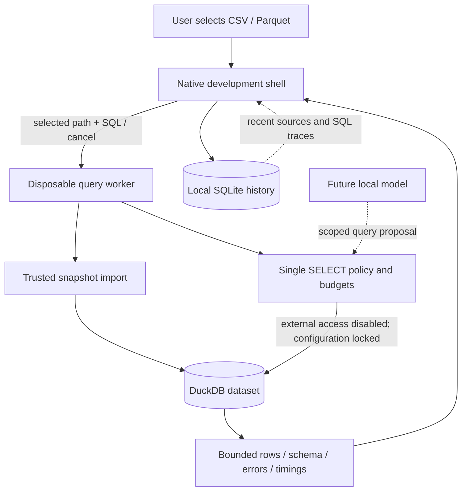

# Architecture and repository

**DECISION:** one narrow selected-file/query/result boundary, no speculative connector or agent package tree.

M1 copies the selected file's logical contents into a transient in-memory table, then removes external access before running SQL. The selected file is never mutated. This deliberately trades repeated import cost for a clearer initial scope boundary. It is not the final lazy-Parquet design. Each request has a fresh process, hard deadline and capped output; cancel terminates that process. No listener or remote API exists in the application.

A process boundary improves cleanup, but is not an OS sandbox. Before generated queries become a product feature, restrict filesystem/network at the OS level, strip ambient credentials, fuzz the policy and validate against the bundled DuckDB version. Human SQL also uses the restricted path in M1; no “advanced mode” escape hatch.

## Actual repository shape

- `apps/macos/`: native developer shell and bundle script.
- `src/quelyt/`: query worker, protocol, policy and SQLite history.
- `tests/`: integration and adversarial policy fixtures.
- `experiments/`: disposable engine, PostgreSQL, AI, retrieval and native probes with raw results.
- `docs/research/`: sources, environment, measured results and limitations.
- `docs/product/`: thesis, scope, decision gates, 30-day plan, ten tasks.
- `docs/adr/`: accepted/provisional choices.
- `docs/evals/`: AI evaluation contracts and retrieval limitations.

No Rust crates, React packages, graph services or connectors are created solely to match the master plan. A future engine replacement must preserve selected-dataset scope, result bounds, errors and cancellation, not expose engine objects to the UI.
